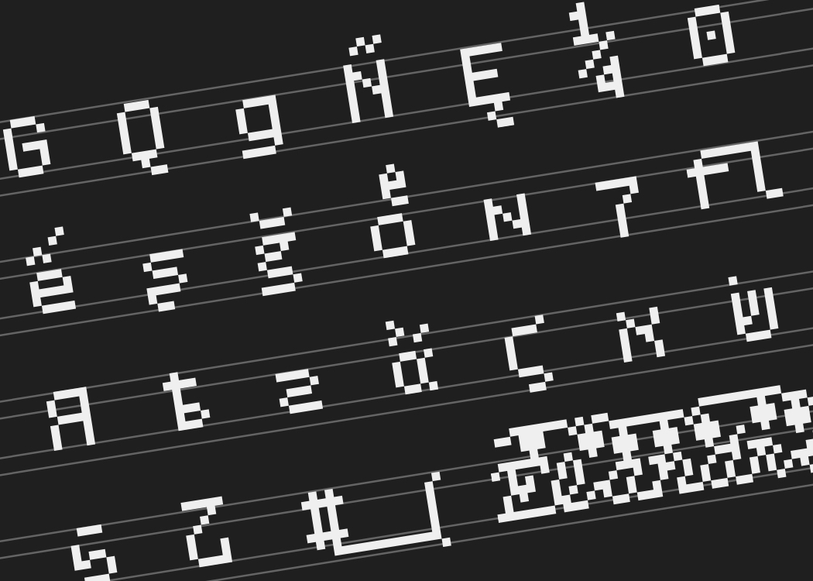
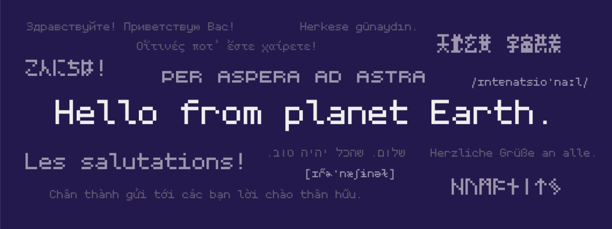
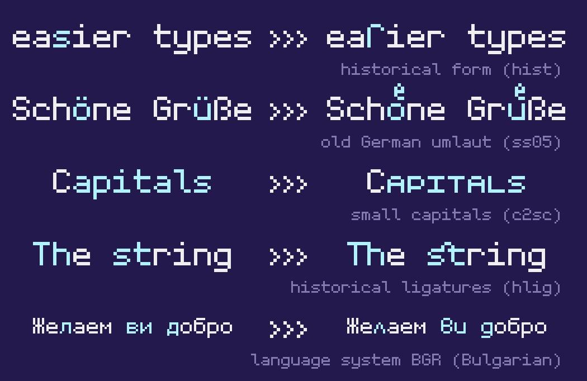
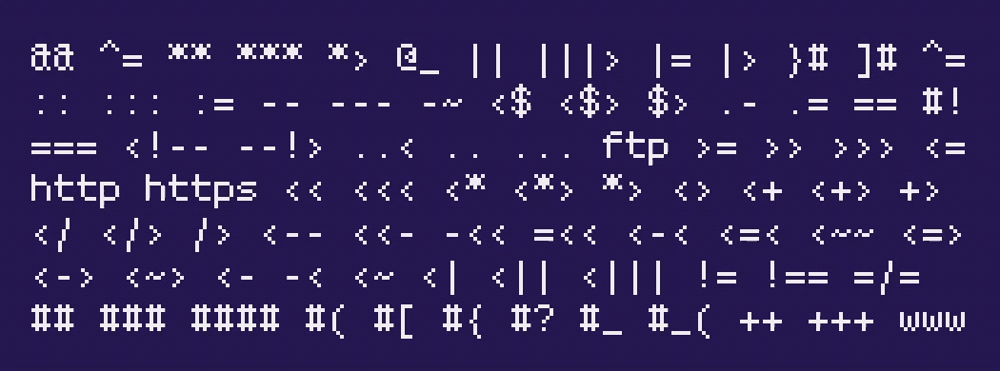
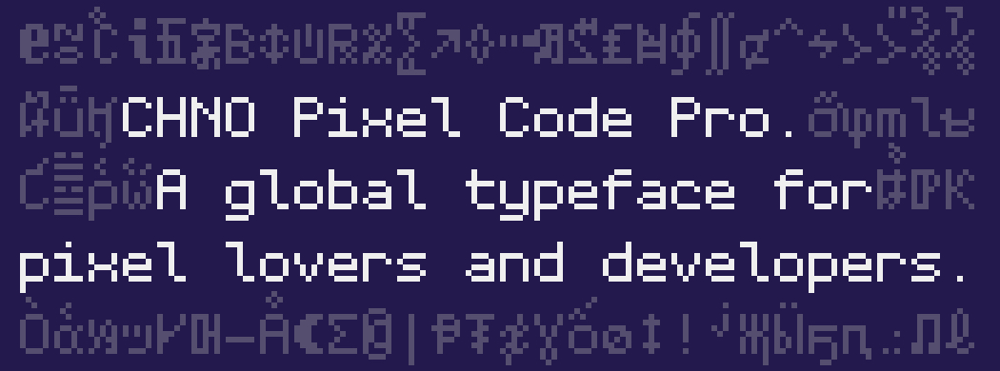

# CHNO Pixel Code Pro

## 介绍

CHNO Pixel Code Pro. 一款为像素爱好者和开发者设计的国际字体.

CHO Pixel Code现已更名为CHNO Pixel Code Pro.

CHNO Pixel Code Pro支持丰富的OpenType特性和世界语言, 和一些来自上世纪的像素怀旧体验!

## 特性

* **支持多种语言.** CHNO Pixel Code Pro支持大部分使用拉丁､ 西里尔和希腊字母表的语言. CHNO Pixel Code Pro还支持希伯来字母､ 日语假名､ 如尼字母和一些汉字.

* **广泛的OpenType特性支持.** CHNO Pixel Code Pro支持超过20种OpenType特性, 包括西里尔字母的保加利亚和塞尔维亚变体.

* **等宽连字.** CHNO Pixel Code Pro支持超过120种等宽连字. 你可以通过启用`dlig`特性来使用它们.

* **新功能: 意大利斜体.** CHNO Pixel Code Pro目前新增了一个意大利体.

* **渲染提示.** 所有风格均已添加渲染提示以确保在小字体下的辨识度.

## 安装

CHNO Pixel Code Pro可以安装在多种平台上.

### macOS

1. 下载字体.
2. 打开 “字体册”.
3. 将下载的字体文件拖入字体册中的字体列表中.

### Windows

1. 下载字体.
2. 选择下载的字体.
3. 右键单击选中的字体, 然后再弹出的菜单中选择“安装”.

### Linux

1. 下载字体.
2. 将字体移动至`~/.local/share/fonts` (如果你想给每个用户都安装此字体的话, 请移动到`/usr/share/fonts`).
3. 在 Terminal 中执行 `fc-cache -f -v`.

对于以上并未提及的操作系统, 请参考系统自带的说明.

## 从源码编译

如果你想从源代码编译, 请参考以下步骤:

### macOS

1. 在 glyphapps.com 下载最新版本的 Glyphs (官网有试用版).
2. 安装 Glyphs (或Glphs Mini).
3. 使用 Glyphs 打开 .glyphs 文件.
4. 按下 Command-E, 然后选择导出选项.
5. 点击“导出”来导出字体文件.

## 其他操作系统

请使用你目前使用操作系统可以运行的一款字体设计软件打开.ufo(Universal Font Object)文件.

## 技术细节

CHNO Pixel Code Pro是一款像素风格等宽字体, 以OpenType和TrueType格式提供(带或不带渲染提示). CHNO Pixel Code Pro可被用在桌面应用和网页设计等. CHNO Pixel Code Pro字体家族包含两个样式(Regular, Italic).

Regular风格包含2,160个字符(包括连字和替换字)和26个OpenType特性. 支持拉丁､ 西里尔､ 希腊字母､ 如尼字母､ 希伯来字母､ 数字(Lining和Old Style), 日语假名, 部分汉字和符号.

Italic风格包含170个字符, 不支持OpenType特性. 支持ASCII字符和几个变音字母.

更多细节可从源文件获取.

## 开源声明

本作品遵守 Creative Commons (创意共享) 发布的 CC BY 4.0 (署名) 协议. 你可以在根目录下的 LICENSE.cn.txt 中找到该协议的全文或访问 <https://creativecommons.org>.

