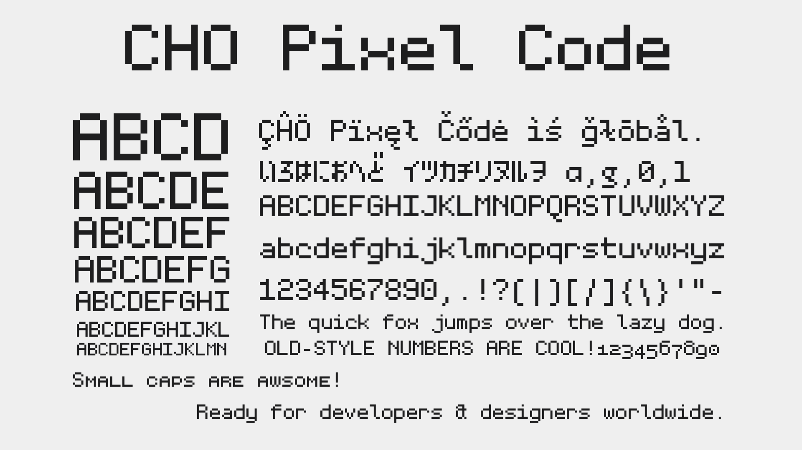
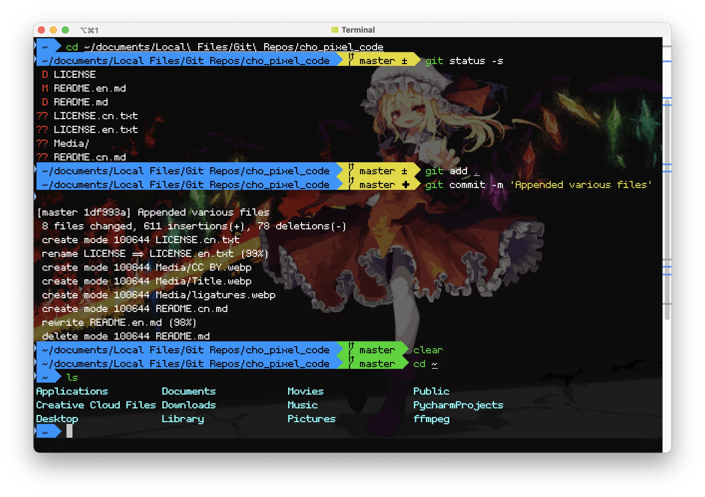
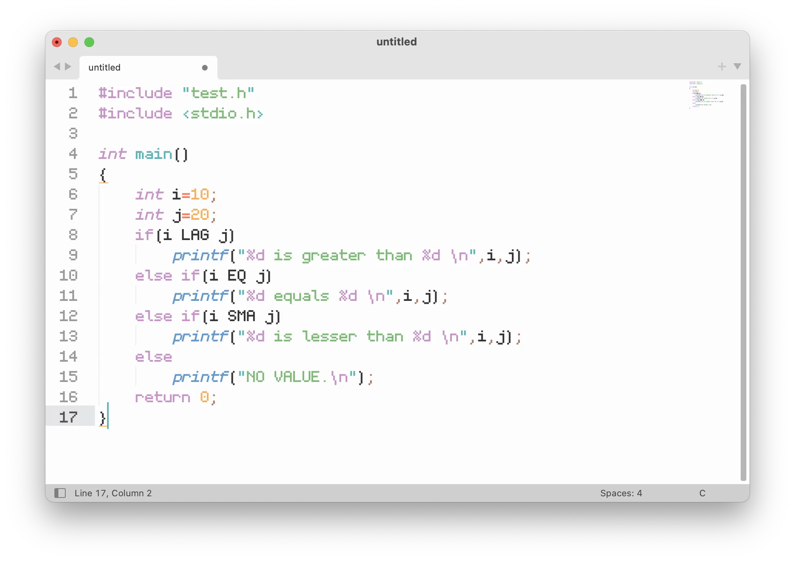
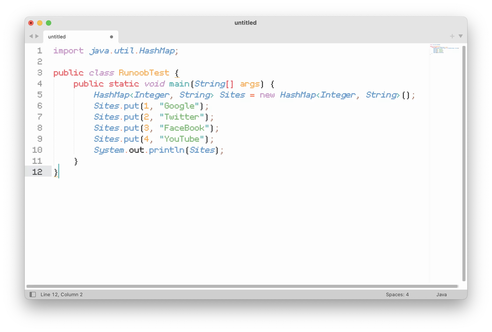

# CHO Pixel Code

## Introductions

My first pixel-monospaced font! Inspired by Fira Code and Jetbrains Mono.

P.S. All the ligatures are included in the clig (contextual ligatures) feature. You can turn it off using macOS’s Font Panel (Use Command-T to open in certain apps) > (…) > Typography > Ligatures > Contextual Ligatures.

## Features

* Supports 170+ languages
* Supports 120+ monospaced ligatures (e.g. `-->`  and  `!=` )
* Optimization of the letter ‘x’ in hexadecimal numbers (e.g. `0xEF`)
* Support for Japanese kana
* Support for OpenType Features and alternative stylistic sets
* Hinting

## Installations

CHO Pixel Code can be installed on multiple platforms:

### macOS

1. Download the font.
2. Open Font Book.
3. Drag the font file (TTF or OTF) into the list to install.

### Windows

1. Download the font.
2. Select the font file (TTF or OTF).
3. Right-click the file, then click "Install" from the pop-up menu.

### Linux

1. Download the font.
2. move the font file to `~/.local/share/fonts` (or `/usr/share/fonts`, if you want to install fonts system-wide).
3. enter `fc-cache -f -v` in the Terminal.

### iOS/iPadOS

1. Download the font.
2. Download iFont from App Store.
3. Open the File app and select the downloaded fonts.
4. Click "Share," and then click "iFont".
5. Navigate to the Installer tab in iFont and click "INSTALL" on the imported font.
6. Enter a name for the profile on the Profile Setup page.
7. A webpage would pop up with an alert saying the website is trying to download a profile. Press the "Allow" button.
8. You will get another alert that the profile has been downloaded.
9. Open settings. a "Profile Downloaded" tab would appear above the "Airplane Mode". Click on that tab.
11. Tap on "Install" at the top right corner.
12. Enter the passcode of your device if you have one.
13. Tap on "Install" at the top right corner.
14. Tap on "Install" again at the bottom.

### Android

1. Download the font.

2. Download iFont from Google Play Store.

3. In the File app, move the font file to `Android SD Card/iFont/Custom`.

4. Open iFont and go to My > My Font.

5. Open the font you just imported. Click "SET" at the bottom.

   Please notice that this method may not work on all Android distributions.

For other platforms, see the instructions provided with the system.

## Supported Monospaced Ligatures:

Please notice that http, https, ftp, and hexadecimal X ligatures may not show up as expected in certain text editors and terminal emulators.  Some text editors do not support ligatures. 

## Builds

The compiled font is offered in 4 formats: TTF, OTF, WOFF, and WOFF2.

However, if you want to build from source, you should follow these steps:

### macOS

2. Download the latest version of Glyphs at glyphsapp.com (you can choose to download the trial version as well). 
3. Install Glyphs on your computer. 
4. Open the .glyphs file using Glyphs. 
5. Press Command-E on your keyboard and select your export options. 
6. Click “Export” to export the font file(s). 

### Other Operating Systems

Please open the .ufo file in the folder using a font editing program on your OS.

## Samples

## Open-Source Declarations

This work is under a Creative Commons CC BY 4.0 License. You can find the full text of this license at LICENSE.en.txt located at the root directory or visit creativecommons.org. 

