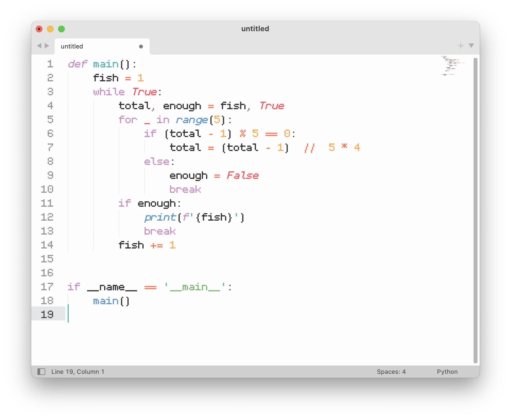

# CHO Pixel Code

[Click here for the English version of this document!](README(ENGLISH).md)

## 介绍

我的第一款像素字体! 参考了Fira Code和Jetbrains Mono的特色连字.

## 特性

- 支持约 120 种等宽连字 (如 `-->` 和 `!=` )
- 支持170+种语言
- 十六进制数字和乘法中'x'的位置优化
- 假名支持
- Hinting

## 安装

CHO Pixel Mono 可以安装在多种平台上.

### macOS

1. 下载字体.
2. 打开 "字体册".
3. 将下载的字体文件拖入字体册中的字体列表中.

### Windows

1. 下载字体.
2. 选择下载的字体.
3. 右键单击选中的字体, 然后再弹出的菜单中选择"安装".

### Linux

1. 下载字体.
2. 将字体移动至`~/.local/share/fonts` (如果你想给每个用户都安装此字体的话, 请移动到`/usr/share/fonts`).
3. 在 Terminal 中执行 `fc-cache -f -v`.

### iOS/iPadOS

1. 下载字体.
2. 在 App Store 中下载 iFont.
3. 打开"文件", 然后选择下载的字体.
4. 点击"分享", 然后点击 iFont.
5. 在 iFont 中找到"Installer"选项卡, 然后再列表中找到想要安装的字体并点击"INSTALL"按钮.
6. 在描述文件设置页面, 输入配置文件的名称(可以随便起).
7. 接下来会弹出一个网页, 点击对话框中的"允许".
8. 对话框会提醒已下载描述文件.
9. 打开设置, 在"飞行模式"上方会出现"已下载描述文件"的选项. 点击此选项.
10. 单击右上角的"安装".
11. 如果你的设备有密码的话, 输入密码.
12. 单击右上角的"安装".
13. 点击屏幕下方的"安装".

### Android

1. 下载字体.

2. 在应用商店下载 iFont.

3. 在"文件管理"中, 将字体文件移动至`Android SD Card/iFont/Custom`.

4. 打开 iFont, 进入我的>我的字体.

5. 打开安装的字体,  然后点击"安装".

   请注意,  此方法可能不适用于部分的 Android 发行版.

对于以上并未提及的操作系统, 请参考系统自带的说明.

## 支持连字列表:

注: http､ https､ ftp 和十六进制连字可能无法在部分文本编辑器中正常显示. 某些文本编辑器不支持连字.

## 从源码编译

编译完成, 可以直接安装的字体以四种格式提供: OTF､ TTF､ WOFF 和 WOFF2.

但如果你想从源代码编译, 请参考以下步骤:

### macOS

1. 在 glyphapps.com 下载最新版本的 Glyphs (官网有试用版).
2. 安装 Glyphs (或Glphs Mini).
3. 使用 Glyphs 打开 .glyphs 文件.
4. 按下 Command-E, 然后选择导出选项.
5. 点击"导出"来导出字体文件.

## 其他操作系统

请使用你目前使用操作系统可以运行的一款字体设计软件打开.ufo(Universal Font Object)文件.

## 显示效果

## 开源声明

本作品遵守美国 Creative Commons (创意共享) 发布的 CC BY 4.0 (署名) 协议. 你可以在根目录下的 LICENSE.cn.txt 中找到该协议的全文或访问 <https://creativecommons.org>.

