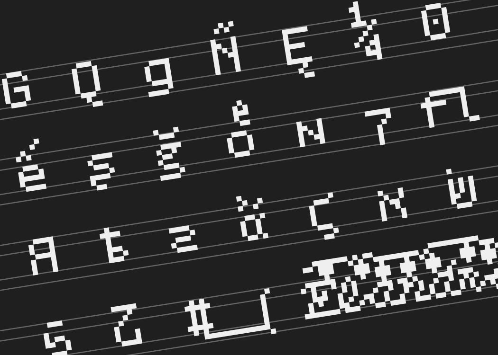
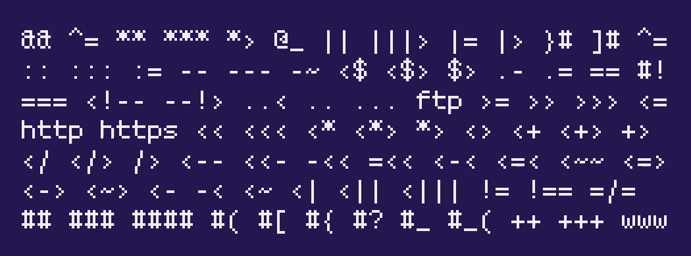
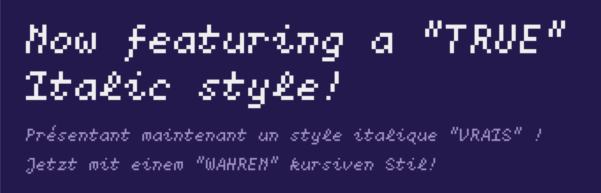

# CHNO Pixel Code Pro

[点击这里来阅读中文版.](README(CN).md)

## Introductions

CHNO Pixel Code Pro. A global typeface for pixel lovers and developers.

CHO Pixel Code has evolved. CHNO Pixel Code Pro is here for you. 

It supports a wide range of OpenType Features and languages so that you can write confidently in your language. All with a touch of old-school computer terminals and video games!

## Features

* **Supports a wide range of languages.** It supports most languages written in Latin, Cyrillic, and the Greek alphabet. It also supports Hebrew, Japanese Kana, Runes, and even some Chinese Characters, making it a truly international typeface.

* **A wide range of OpenType features.** In programs that support OpenType features, you can fully realize the full potential of this typeface. More than 20 unique features make it more than suitable for people seeking a touch of diversity. It also includes supports Bulgarian and Serbian variations of the Cyrillic alphabet!

* **Monospaced ligatures.** To increase the legibility of codes in small font size, CHNO Pixel Code Pro has 120+ monospaced ligatures! Just enable the `dlig` (Discretionary Ligatures) feature in your editor, and you are good to go.

* **NEW: TRUE Italics!** A TRUE Italic version is now available for CHNO Pixel Code Pro, and it supports most languages in western Europe!

* **Hinting.** Hinting was added to the entire font family to ensure eligibility at a tiny font size. 

## Installations

CHO Pixel Code can be installed on multiple platforms:

### macOS

1. Download the font.
2. Open Font Book.
3. Drag the font file (TTF or OTF) into the list to install.

### Windows

1. Download the font.
2. Select the font file (TTF or OTF).
3. Right-click the file, then click "Install" from the pop-up menu.

### Linux

1. Download the font.
2. Move the font file to `~/.local/share/fonts` (or `/usr/share/fonts`, if you want to install fonts system-wide).
3. Enter `fc-cache -f -v` in the Terminal.

For other platforms, see the instructions provided with the system.

## Builds

If you want to build the typeface from the source, please follow these steps:

### macOS

1. Download the latest version of Glyphs at glyphsapp.com (you can choose to download the trial version as well). 
2. Install Glyphs on your computer. 
3. Open the .glyphs file using Glyphs. 
4. Press Command-E on your keyboard and select your export options. 
5. Click “Export” to export the font file(s). 

### Other Operating Systems

Please open the .ufo file in the folder using a font editing program on your OS.

## Technical Details

CHNO Pixel Code Pro is a pixel-styled monospaced typeface, provided in OpenType and TrueType format with or without hinting, and can be used in desktop applications and web designs. It comes in a font family with two styles (Regular, Italic).

The Regular font contains 2,610 characters (including ligatures and alternates) and 26 OpenType features. It supports extended Latin, Cyrillic, Greek alphabet, Runes, Hebrews, Numerals (lining/old-style), Japanese kana, some Kanji, and symbols. 

The Italic font contains 170 characters and no OpenType features. It supports ASCII characters and a few more letters with diacritics. 

More details can be found within the source files. 

## Open-Source

This work is under a Creative Commons CC BY 4.0 License. You can find the full text of this license at LICENSE.en.txt located at the root directory or visit creativecommons.org. 

